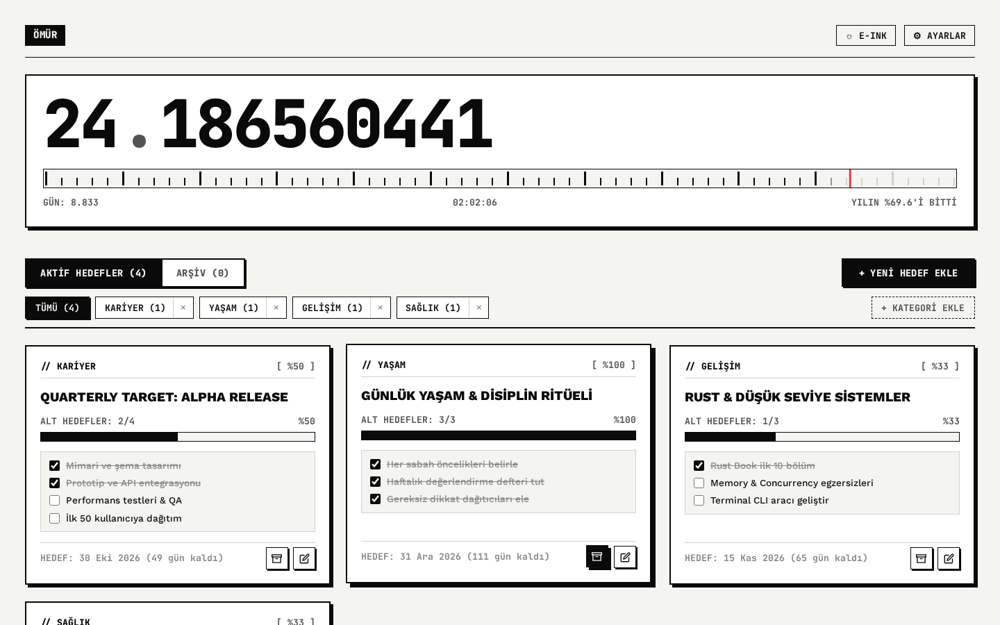
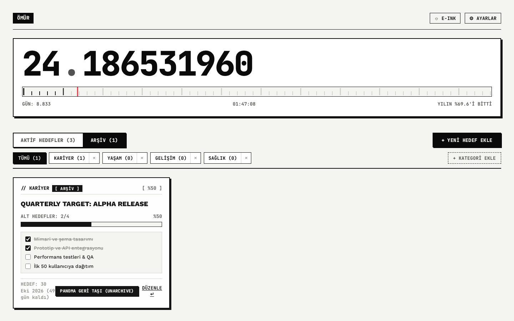
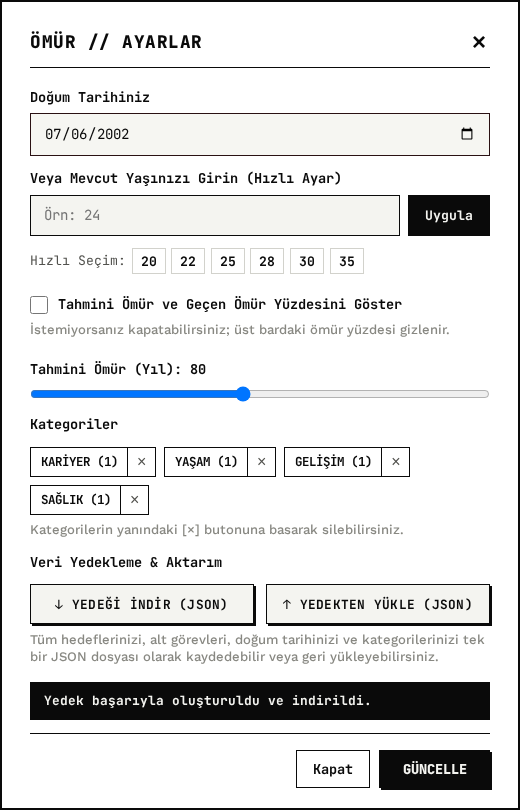
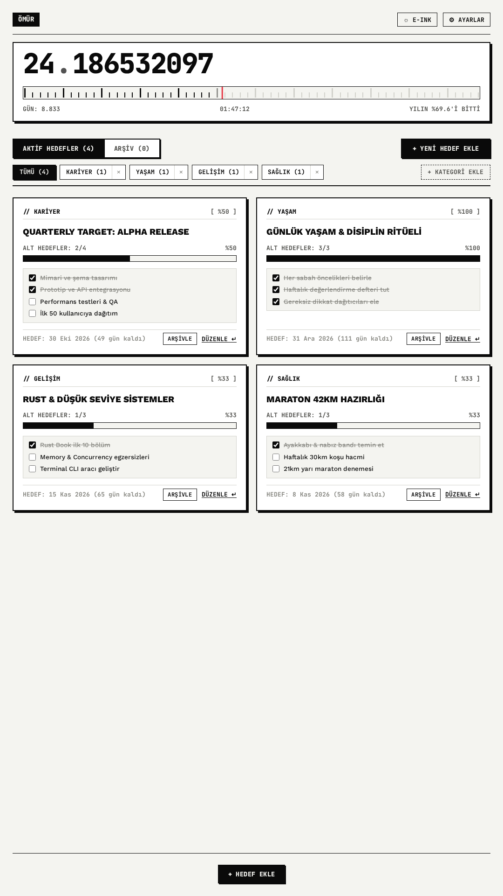
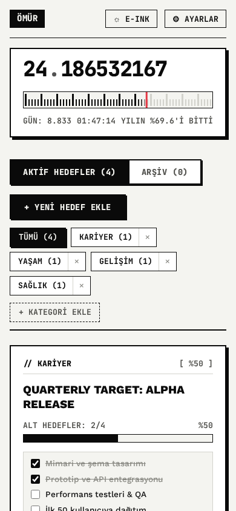

<div align="center">
    
    <h1>
        <b>Ömür</b>
    </h1>
    Yeni sekme sayfasını canlı yaş sayacına ve vizyon panosuna dönüştüren Chrome eklentisi.
</div>

<br>

<div align="center">
    <a href="https://developer.chrome.com/docs/extensions/mv3/"></a>
    <a href="https://developer.mozilla.org/en-US/docs/Web/JavaScript"></a>
    <a href="https://developer.mozilla.org/en-US/docs/Web/CSS"></a>
    <a href="LICENSE"></a>
</div>

<br>

## Genel Bakış

**Ömür**, tarayıcınızın yeni sekme ekranını kişiselleştirilebilir bir vizyon panosuna ve anlık yaş sayacına dönüştürür. Yeni bir sekme açtığınızda hedeflerinizi, tamamlanma durumlarını ve geçen zamanı sade bir arayüzde görmenizi sağlar.

Temel olarak iki parçadan oluşur:
1. **Canlı Yaş Sayacı:** Doğum tarihinize göre anlık akan yaş göstergesi ve saniyeleri tarayan zaman cetveli.
2. **Hedef Panosu:** Alt görevlerle detaylandırılabilen, ilerleme takibi yapılabilen ve görsellerle desteklenebilen hedef kartları.

<br>

## Öne Çıkan Özellikler

- ⏳ **Canlı Yaş Sayacı:** Doğum tarihinize göre anlık olarak güncellenen yaş göstergesi ve altındaki zaman cetveli ibresi.
- 🎯 **Vizyon Panosu:** Kart yapısında hedefler, özel görsel ekleme desteği, kategori rozetleri ve hedef tarih göstergeleri.
- ☑️ **Alt Görevler ve Otomatik İlerleme:** Her hedefe eklenebilen kontrol listeleri (subtasks). Kart üzerindeki onay kutuları işaretlendikçe ilerleme yüzdesi otomatik hesaplanır.
- 🗄️ **Arşivleme:** Tamamlanan veya geçici olarak odak dışında kalan hedefleri ana panodan ayırmak için ayrı Arşiv sekmesi. Arşivdeki hedefler istendiğinde tek tıkla panoya geri taşınabilir.
- 🏷️ **Kategori Yönetimi:** Hedefleri kategorilere (`KARİYER`, `SAĞLIK`, `FİNANS`, `YAŞAM` vb.) ayırma, sekme üzerinden filtreleme ve ayarlardan yeni kategori ekleme/silme.
- 💾 **JSON Dışa / İçe Aktarma:** Tüm pano verilerini, ayarları ve hedefleri tek tıkla JSON dosyası olarak indirme veya geri yükleme.
- 🖥️ **Dikey (Portrait) & Geniş Ekran Uyumu:** 1080x1920 dikey monitörler için 2 kolonlu şelale düzeni, ultrawide monitörler için 4 kolonlu ızgara, dizüstü ve mobil ekran uyumu.
- 🖤 **E-Ink & Monokrom Tema:** Mat kağıt dokusu, net tipografi (`JetBrains Mono` ve `Work Sans`) ve dikkat dağıtmayan kontrastlı tasarım.

<br>

## Ekran Görüntüleri

<p align="center">
  
</p>

<p align="center">
  
  
</p>

<p align="center">
  
  
</p>

<br>

## Teknoloji Yığını

- **Manifest V3:** Güncel Chromium eklenti standardı (`chrome_url_overrides.newtab`)
- **Vanilla JavaScript (ES6+):** Harici kütüphane veya derleme adımı gerektirmeyen hafif mimari
- **Modern CSS:** CSS Grid, Flexbox, responsive breakpointler ve CSS değişkenleri
- **Chrome Storage API:** `chrome.storage.local` tabanlı yerel veri yönetimi (bağımsız testler için `localStorage` desteği)
- **HTML5 Canvas / SVG:** Sekme ikonu için dinamik kum saati gösterimi

<br>

## Dizin Yapısı

```
.
├── assets/
│   ├── icons/                            # Eklenti boyut ikonları (16, 32, 48, 128 px)
│   └── plates/                           # Örnek kart görsel şablonları
├── docs/
│   └── screenshots/                      # Dokümantasyon ekran görüntüleri
│       ├── board-desktop.png             # Ana pano ekranı
│       ├── archive-view.png              # Arşiv ekranı
│       ├── settings-modal.png            # Ayarlar ve veri yedekleme
│       ├── portrait-monitor.png          # Dikey monitör yerleşimi
│       └── mobile-view.png               # Mobil görünüm
├── app.js                                # Uygulama mantığı, sayaç, veri ve modal yönetimi
├── DESIGN.md                             # Tasarım sistemi kuralları ve stil rehberi
├── favicon.svg                           # Kum saati vektör ikonu
├── index.html                            # Ana arayüz ve modal şablonları
├── LICENSE                               # GNU General Public License v3.0
├── manifest.json                         # Chrome Extension Manifest V3 konfigürasyonu
├── PRODUCT.md                            # Ürün dokümantasyonu
├── README.md                             # Proje tanıtımı
└── style.css                             # Arayüz stilleri ve responsive grid
```

<br>

## Kurulum

Ömür, Chromium tabanlı tüm tarayıcılarda (Google Chrome, Brave, Microsoft Edge, Arc, Opera vb.) doğrudan çalıştırılabilir.

### 1. Depoyu İndirin
```bash
git clone https://github.com/sametalkis/omur.git
```
*(veya GitHub üzerinden ZIP olarak indirin)*

### 2. Tarayıcı Eklentiler Sayfasını Açın
- Chrome / Brave / Arc: `chrome://extensions`
- Edge: `edge://extensions`

### 3. Geliştirici Modunu Açın
Sayfanın sağ üstündeki **"Geliştirici modu"** anahtarını aktif hale getirin.

### 4. Paketlenmemiş Öğe Yükle
**"Paketlenmemiş öğe yükle" (Load unpacked)** butonuna tıklayın ve deponun bulunduğu klasörü seçin.

### 5. Kullanım
Yeni bir sekme açarak (`Ctrl + T` / `Cmd + T`) panonuzu kullanmaya başlayabilirsiniz.

<br>

## Veri Modeli ve Depolama

Uygulama verileri şu an tarayıcının yerel depolama alanında (`chrome.storage.local` / `localStorage`) tutulmaktadır:

- `omur_birthdate`: Doğum tarihi bilgisi
- `omur_goals`: Hedef kartları dizisi (başlık, kategori, hedef tarih, alt görevler, görsel, arşiv durumu)
- `omur_categories`: Kategori listesi
- `omur_theme`: Aktif tema tercihi
- `omur_life_expectancy`: Tahmini yaşam süresi ayarı
- `omur_show_life_exp`: Yaşam süresi gösterim tercihi

Veri modeli modüler ve bağımsız tutulduğundan, Ayarlar menüsünden tek tıkla JSON yedeği alınabilir ve geri yüklenebilir. İleride eklenebilecek bulut senkronizasyonu veya hesap eşitleme özellikleri için bu veri yapısı doğrudan kullanılabilir.

### Örnek JSON Yedek Formatı

```json
{
  "version": "1.1.0",
  "appName": "Ömür",
  "exportedAt": "2026-09-12T02:00:00.000Z",
  "data": {
    "birthDate": "2000-01-01T00:00",
    "showLifeExpectancy": false,
    "lifeExpectancy": 80,
    "theme": "e-ink",
    "categories": ["GENEL", "KARİYER", "SAĞLIK", "BİLGİ"],
    "goals": [
      {
        "id": "goal_1741738000000_abc",
        "title": "Minimalist Bir Yaşam Alanı Kur",
        "category": "YAŞAM",
        "targetDate": "2026-12-31",
        "subtasks": [
          { "id": "st_1", "text": "Gereksiz eşyaları ayıkla", "completed": true },
          { "id": "st_2", "text": "Çalışma masasını düzenle", "completed": false }
        ],
        "image": "data:image/png;base64,...",
        "archived": false,
        "archivedAt": null,
        "createdAt": "2026-09-12T01:00:00.000Z"
      }
    ]
  }
}
```

<br>

## İlham

Bu proje, Chrome Web Store'daki [Motivation](https://chromewebstore.google.com/detail/motivation/aliachjmgkelibfecomdccomahgpople) eklentisinden ilham alınarak geliştirilmiştir.

<br>

## Katkıda Bulunma

1. Depoyu forklayın (`Fork`).
2. Yeni bir özellik dalı oluşturun (`git checkout -b feature/yeni-ozellik`).
3. Değişikliklerinizi commit edin (`git commit -m 'feat: yeni ozellik'`).
4. Dalınıza push yapın (`git push origin feature/yeni-ozellik`).
5. Bir Pull Request açın.

<br>

## Lisans

Bu proje **GNU General Public License v3.0 (GPL-3.0)** altında lisanslanmıştır. Detaylar için [LICENSE](LICENSE) dosyasına bakınız.
